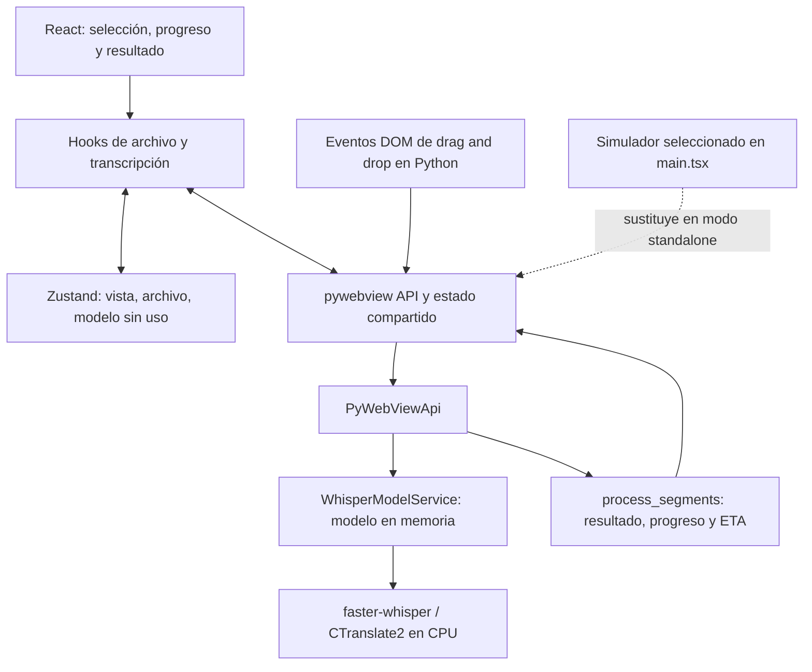

# PyWhisper Studio: alcance, estado y plan de continuación

Revisión: **1 de octubre de 2026**. Rama: `feature/progress-loader`. Commit: `4e9abda` (`temp`, 27 de diciembre de 2025).

Este documento reconstruye el proyecto a partir del código, los 24 commits de la rama sobre `main`, el historial anterior, las otras ramas remotas, las PR públicas y comprobaciones locales. Las recomendaciones son propuestas; no constituyen funcionalidades previamente acordadas ni implementadas.

## 1. Dónde se quedó el proyecto

**Hay un prototipo de aplicación de escritorio para transcribir un archivo de audio o vídeo con faster-whisper. La rama actual está completando la experiencia de transcripción: progreso, cancelación, tiempo restante y presentación del resultado. Todavía no está lista para distribuir.**

La infraestructura principal existe: ventana nativa, puente Python/JavaScript, selección de archivo, carga y reutilización del modelo, inferencia, segmentos con tiempos, estado compartido, traducciones y configuración de empaquetado. Quedan por cerrar el comportamiento ante errores y cancelaciones, las pruebas de integración y una salida útil del resultado.

El último commit dejó `isStandalone={true}` en [main.tsx](frontend/src/main.tsx). Ese modo instala una API simulada que ofrece un archivo ficticio y devuelve tres segmentos de prueba. **La configuración actual no es una configuración válida para comprobar la transcripción real de extremo a extremo**, aunque la ventana abra y el loader avance. En una ventana nativa, además, el simulador compite con la inyección del puente real.

La evidencia apunta a que el trabajo quedó pausado mientras se probaban las animaciones de entrada del resultado. Esto es una **inferencia** por el contenido de `temp`; su mensaje no explica la intención.

### Lectura rápida

| Pregunta | Respuesta |
| --- | --- |
| ¿Qué se pretende construir? | Una GUI de escritorio sobre faster-whisper, con procesamiento local de medios. |
| ¿Qué resolvía `main`? | Integración inicial de transcripción y una selección de archivo más completa, con drag and drop y Zustand. |
| ¿Qué añade esta rama? | Progreso, navegación selección/transcripción, cancelación, ETA, animaciones y primera pantalla de resultados. |
| ¿Qué estaba haciendo `temp`? | Mostrar segmentos con entrada escalonada y facilitar su prueba con el simulador. |
| ¿Funciona el build web? | Sí, con una advertencia de CSS. |
| ¿Están verdes todas las comprobaciones? | No: falla 1 de 18 tests, ESLint, Ruff completo y MyPy. |
| ¿Se ha verificado aquí una transcripción real? | No. Las verificaciones de esta revisión son build, análisis, tests y pruebas aisladas de lógica. |
| ¿Hay exportación? | No. Existe un formateador de tiempos SRT usado para logs, pero no una función de exportación. |
| ¿Hay una versión publicada? | La API pública de GitHub devuelve cero releases y el repositorio local no tiene tags. |

## 2. Alcance confirmado y alcance propuesto

### Confirmado por el código y el historial

- Aplicación de escritorio con Python, pywebview, React y TypeScript.
- Selección de **un archivo local cada vez**, mediante diálogo nativo o arrastre.
- Audio y vídeo, con extensiones admitidas enumeradas en [constants.py](backend/constants.py). La lista de extensiones no garantiza por sí sola que cualquier contenido sea decodificable.
- Transcripción con faster-whisper; el frontend pasa actualmente el modelo `base`.
- Progreso por segmentos, solicitud de cancelación y estimación del tiempo restante.
- Resultado formado por `TranscriptionSegment`, con `id`, `text`, `start` y `end`.
- Desarrollo de UI en navegador con un simulador del puente.
- Configuración de distribución para Windows y macOS mediante PyInstaller.

No hay una especificación de producto completa: `README.md` tiene vacía la sección Features, y `DEV_NOTES.md` contiene principalmente ideas visuales. GitHub devuelve las seis PR históricas, todas cerradas y fusionadas, sin issues independientes ni PR abiertos en la consulta realizada. Por eso el backlog de este informe combina TODO existentes, defectos observados y propuestas explícitas.

### Primera versión utilizable que propongo

Seleccionar un archivo → transcribirlo con un modelo documentado → ver progreso y cancelar → leer y copiar/exportar el resultado → empezar de nuevo. Los errores deben tener una explicación visible y permitir volver a intentarlo de forma manual.

La exportación a TXT y SRT sería la ampliación de mayor utilidad inmediata. Es una **propuesta**, aunque el formateador SRT existente hace que encaje con el trabajo previo. No hace falta un editor completo para llegar a esta primera versión.

### Funciones que no están implementadas ni justificadas como compromiso previo

Grabación desde micrófono, transcripción en directo, diarización de hablantes, cola de varios archivos, historial persistente, edición de subtítulos, reproducción sincronizada, cuentas, nube y sincronización. La entrada por URL aparece como una posibilidad en el backend y en un TODO; no tiene interfaz ni un flujo de producto definido.

## 3. Cómo evolucionó el proyecto

### Base anterior a esta rama

| Fecha | Commit / PR | Qué dejó construido |
| --- | --- | --- |
| Noviembre de 2025 | `a3a4eef`, `b8fbbc1` | Estructura Python/React, scripts, generación de tipos y configuración de PyInstaller. |
| 25/11/2025 | `d19226f`, [PR #1](https://github.com/jolacdev/PyWhisper-Studio/pull/1) | faster-whisper, selección básica, API de transcripción y formateador SRT. |
| 25/11/2025 | `405f76e`, [PR #2](https://github.com/jolacdev/PyWhisper-Studio/pull/2) | Correcciones de dependencias y herramientas de análisis. |
| 27/11/2025 | `e4daae1`, [PR #3](https://github.com/jolacdev/PyWhisper-Studio/pull/3) | Organización del frontend por features, shared y alias. |
| 27–30/11/2025 | `4a136fe`, `c57a71f`, [PR #4](https://github.com/jolacdev/PyWhisper-Studio/pull/4) | Nombre PyWhisper Studio, logging, modelos en el directorio de datos del usuario y refactor del servicio. Se retiró `torch` tras haberlo añadido en la corrección anterior. |
| 30/11/2025 | `4c1b068`, [PR #5](https://github.com/jolacdev/PyWhisper-Studio/pull/5) | Esquema `TranscriptionSegment` y ajustes de alias. |
| 09/12/2025 | `35704b5`, [PR #6](https://github.com/jolacdev/PyWhisper-Studio/pull/6) | Dropzone, preview, Zustand, sincronización del archivo, mocks, componentes, i18n y CPU forzada por un problema de cuDNN en Windows. Este es `main`. |

### Los 24 commits de `feature/progress-loader`

| Fecha | Commit | Aportación |
| --- | --- | --- |
| 10/12 | `6a0fff1` | Publicación de `transcriptionProgress` desde Python. |
| 11/12 | `3184b9e` | `currentView` para cambiar de pantalla. |
| 11/12 | `8532b38` | Solicitud de cancelación durante la transcripción. |
| 11/12 | `11087d6` | Incorporación de `FileTranscriptionScreen` que faltaba. |
| 13/12 | `19ab628` | Componente genérico `ProgressLoader`. |
| 13/12 | `7ce877b` | Corrección de la pista de fondo del progreso circular. |
| 13/12 | `b96b999` | Simulador adaptado al nuevo flujo. |
| 14/12 | `f1b7b98` | Animación de puntos y ajustes de tema. |
| 14/12 | `189f5b5` | Setter en `usePyWebViewState`. |
| 14/12 | `e6e3140` | Conservar el archivo seleccionado tras cancelar. |
| 14/12 | `ccd3bc9` | Reiniciar el progreso al abortar. |
| 14/12 | `40ae738` | `TranscriptionLoader` y sincronización de estado. |
| 14/12 | `661f225` | Reset del estado al comenzar la petición. |
| 14/12 | `155e204` | Flujo de ejecución en la pantalla de transcripción. |
| 15/12 | `a7451e4` | Actualización de tests del simulador. |
| 15/12 | `319854d` | Animaciones en fichero separado y nombre `animate-loading-dots`. |
| 16/12 | `4fc1454` | Actualización de React y excepciones a `minimumReleaseAge`. |
| 17/12 | `c2657c1` | Motion y transiciones de entrada/salida. |
| 23/12 | `8733899` | Estado compartido, `stateKeys` y limpieza del store/puente. |
| 23/12 | `496f493` | Consolidación del nombre `isAbortRequested`. |
| 23/12 | `935bf41` | Extracción de `useSyncedTranscription`. |
| 27/12 | `3e66e0e` | Estimación de segundos restantes. |
| 27/12 | `3fb9bf0` | Configuración estable recommended de react-hooks en ESLint. |
| 27/12 | `4e9abda` | `temp`: primera visualización animada de segmentos y modo simulado activo. |

Todas estas fechas de la tabla son de 2025. La rama modifica 28 archivos respecto a `main`, antes de contar los cambios locales recientes.

### Qué significa exactamente el commit temporal

[Diff de `4e9abda`](https://github.com/jolacdev/PyWhisper-Studio/commit/4e9abda36fdf353da633256949cf6bfd65aafe8c):

1. `TranscriptionResult` empieza a renderizar los segmentos recibidos, con una etiqueta que muestra `start` sin formatear y el texto.
2. Se añade `animate-fade-in-left`, con un retraso de `index × 150 ms`.
3. Se usa un contenedor absoluto para la composición de la pantalla.
4. El botón `Reset` continúa como demo y llama a `clearStore()`.
5. Se retira el uso directo de `usePyWebViewState` en ese botón. Su antigua llamada queda comentada; actualmente `clearStore` ya intenta limpiar el puente, así que ese comentario está desactualizado.
6. `main.tsx` cambia a `isStandalone={true}`.
7. `DEV_NOTES.md` añade un enlace a AnimatePresence.

No introduce un nuevo motor de transcripción ni modifica el contrato de la API. El nombre de la rama se ha quedado algo corto: el trabajo ya abarca buena parte del flujo de transcripción y resultados.

### Otras ramas remotas

`git ls-remote --heads origin` confirmó que los commits remotos coinciden con las referencias locales consultadas.

| Rama | Lectura del historial |
| --- | --- |
| `main` | Base integrada hasta selección de archivo. |
| `feature/progress-loader` | Trabajo actual, todavía no fusionado con `main`. |
| `bugfix/correct-dependencies-and-linting` | Trabajo histórico relacionado con PR #2; no representa el estado actual de dependencias. |
| `bugfix/replace-print-with-logging` | Iteraciones antiguas con varios commits `temp`, relacionadas con la integración de logging de PR #4. |
| `feature/dropzone_old-notransition-` | Variante anterior a la selección integrada en PR #6, con nombres y estructura antiguos. |
| `components` | Experimento antiguo de componentes, anterior al desarrollo actual. |

Varias integraciones se hicieron mediante squash: que los commits originales de una rama no sean ancestros de `main` no significa que su funcionalidad esté pendiente. Las ramas antiguas sirven como referencia histórica; antes de recuperar algo de ellas habría que comparar el cambio concreto con lo ya integrado. No se han fusionado ni eliminado ramas en esta revisión.

## 4. Mapa de la arquitectura actual

| Área | Archivo principal | Responsabilidad actual |
| --- | --- | --- |
| Arranque nativo | [backend/main.py](backend/main.py) | Logging, ventana, API y registro de drag and drop. |
| Entrada frontend | [webview_helpers.py](backend/helpers/webview_helpers.py) | Vite en desarrollo o assets compilados/empaquetados. |
| API pública | [api.py](backend/api/api.py) | Diálogo de archivo y petición de transcripción. |
| Modelo | [whisper_service.py](backend/service/whisper_service.py) | Descargar/cargar, reutilizar modelo y llamar a faster-whisper. |
| Consumo de segmentos | [whisper_utils.py](backend/utils/whisper_utils.py) | Cancelación cooperativa, transformación a DTO, progreso y ETA. |
| Selección por arrastre | [drag_drop_handler.py](backend/helpers/drag_drop_handler.py) | Validar dropzone y archivo; escribir `transcriptionFile`. |
| Estado de aplicación | [useAppStore.ts](frontend/src/store/useAppStore.ts) | Vista, copia del archivo, acciones de limpieza y campo `model` sin conectar. |
| Suscripción al puente | [usePyWebViewState.ts](frontend/src/shared/hooks/usePyWebViewState.ts) | Estado React local por propiedad y suscripción a cambios. |
| Flujo de transcripción | [useSyncedTranscription.ts](frontend/src/features/transcription/hooks/useSyncedTranscription.ts) | Iniciar petición al montar, cancelar y procesar su resolución. |
| Resultado | [FileTranscriptionScreen.tsx](frontend/src/screens/FileTranscriptionScreen.tsx) | Mantener segmentos en estado local y alternar loader/resultado. |
| Contrato generado | [pywebview-api.d.ts](frontend/src/types/pywebview/pywebview-api.d.ts) | Nombres y firmas de API/DTO generados desde Python. |
| Estado del puente | [pywebview-state.ts](frontend/src/types/pywebview/pywebview-state.ts) | Contrato escrito a mano, separado del generado. |
| Empaquetado | [pywebview-react.spec](pyinstaller/pywebview-react.spec) | Construcción Windows/macOS, inclusión de frontend y opciones de bundle. |

### Flujo real previsto

El diálogo devuelve `FileMetadata`; React lo escribe en el estado compartido. El arrastre lo escribe directamente desde Python. `useSyncedTranscriptionFile` copia los cambios al store. Al pulsar Transcribir se cambia de vista y, al montar el loader, se llama a `run_transcription(path, 'base')`.

Python reinicia los campos de progreso/cancelación, carga el modelo y obtiene un generador de segmentos. `process_segments` lo recorre, publica progreso y ETA y devuelve la lista completa. **Los segmentos no se muestran a medida que se producen**: React recibe la lista cuando termina la promesa. Cancelar escribe `isAbortRequested`; Python lo comprueba entre segmentos.

Los modelos se guardan en `user_data_dir(APP_NAME)/models`, los logs en `user_log_dir(APP_NAME)`, y el resultado solo vive en memoria. La primera carga puede requerir red para descargar el modelo. No hay un flujo de gestión de descargas o de historial de transcripciones.

## 5. Funcionalidades: qué hay y qué falta

| Función | Estado | Límite actual |
| --- | --- | --- |
| Seleccionar archivo con diálogo | Implementada | Falta validación integral con el puente real en esta revisión. |
| Drag and drop | Implementado, con corrección local reciente | Pendiente probar un arrastre real y recarga de la ventana. |
| Preview y eliminar selección | Implementados | Nombre, tamaño e icono según tipo. |
| Inferencia local | Implementada en backend | Modelo `base` fijo desde UI y CPU forzada. |
| Reutilización del modelo | Implementada | Un modelo en memoria; sin coordinación explícita de llamadas simultáneas. |
| Progreso | Implementado | Aproximación por tiempo final de segmento/duración; no cubre todo el arranque. |
| ETA | Implementada | Aproximación lineal, sin fases explícitas ni suavizado. |
| Cancelación | Parcial | Cooperativa; no interrumpe descarga, carga del modelo ni cálculo ya iniciado. |
| Pantalla de resultados | Prototipo | Lista de segmentos, tiempos sin formato, botón Reset de demo. |
| Errores y audio sin voz | Pendiente | No hay feedback adecuado; varios errores se convierten en `[]`. |
| Exportar / copiar | Ausente | El texto transcrito no tiene una acción de salida. |
| Cambiar modelo | Ausente en UI | La API acepta nombre, pero `model` del store no se utiliza. |
| Idiomas de interfaz | Base EN/ES existente | `lng: 'en'` fijo; sin selector ni persistencia. |
| Idioma/tarea de transcripción | Sin controles | Se delega en los valores por defecto del motor. |
| Distribución | Configuración existente | Sin release publicada ni build nativo validado en esta auditoría. |

## 6. Hallazgos y pendientes, por prioridad

**P0**: impide validar o confiar en el flujo principal. **P1**: conviene resolver antes de dar la rama por terminada. **P2**: mejora del producto o mantenimiento posterior.

### P0 — Asegurar que la aplicación utiliza el backend real

`isStandalone={true}` activa `createPyWebViewMock()`, que asigna `window.pywebview`. Es un hecho del código, introducido en `temp`. Además de producir resultados ficticios, puede interferir con el objeto que crea el host nativo.

**Propuesta:** definir explícitamente dos modos de desarrollo, demo y escritorio. El build de escritorio debe seleccionar el puente real; el simulador debería activarse con una opción de desarrollo específica. Probar ambos modos. La ausencia temporal del puente durante el arranque no debería decidir automáticamente que se use el mock.

### P0 — Distinguir error, cancelación y resultado vacío

En [api.py](backend/api/api.py), las excepciones capturadas se registran y terminan en `return []`. `process_segments` también devuelve `[]` al cancelar, y una entrada sin segmentos produce otra lista vacía. React solo mira aparte `isAbortRequested`; si no está activo, ejecuta `onTranscriptionComplete([])`. Una lista vacía es truthy en JavaScript, por lo que se llega a la pantalla de resultado.

**Confirmación aislada:** una excepción `FileNotFoundError` simulada en el servicio devolvió `[]`; un iterable de segmentos vacío con duración positiva terminó con progreso 100. No fue necesario cargar un modelo para reproducirlo.

**Propuesta:** definir semánticas distintas. Como primer paso se pueden propagar los errores al `catch` del frontend y añadir feedback para ausencia de voz. Si se introduce un resultado etiquetado para completado/cancelado/vacío, habrá que actualizar el contrato y el simulador conjuntamente. Cambiar silenciosamente la firma de `run_transcription` sería incorrecto.

### P1 — Cerrar el ciclo de cancelación y las peticiones en curso

La comprobación de cancelación está dentro de `for s in raw_segments`, después de obtener el siguiente segmento. La prueba con un generador instrumentado confirmó que se consume un elemento incluso si el flag ya está activo antes de entrar. La cancelación no interrumpe una operación de inferencia ya en marcha. Al abortar se limpia el progreso, pero queda la ETA anterior hasta otra inicialización.

`useSyncedTranscription` inicia trabajo desde un efecto y usa un ref para impedir duplicados dentro de esa instancia. No hay exclusión equivalente en Python ni identidad de petición. Una recarga/remontaje puede iniciar otra llamada mientras una anterior sigue viva; el estado compartido se conserva entre recargas según pywebview. **Es un riesgo derivado del código y del ciclo de vida, no una carrera reproducida en una transcripción real.**

**Propuesta:** una transcripción activa controlada desde Python, cancelación asociada a ese trabajo y resolución terminal clara. Verificar cancelación durante carga, durante segmentos y justo antes del final. Si se admiten remontajes o sustitución de trabajo, añadir un identificador para descartar respuestas antiguas. No hace falta una cola general para procesar un archivo cada vez. Las llamadas del puente se ejecutan en hilos y no son automáticamente thread-safe: [documentación de pywebview](https://pywebview.flowrl.com/guide/interdomain.html#run-python-from-javascript).

### P1 — Separar porcentaje de estado de finalización

`completed` y `hasFinished` se deducen de `progress === 100`. El porcentaje está redondeado: un segmento cerca del final puede dar 100 antes de que la promesa termine. Del mismo modo, 0 agrupa carga del modelo, preparación y cualquier transcripción que todavía no haya producido un segmento.

El reloj de ETA empieza después de `whisper_service.transcribe(...)`, por lo que excluye la carga/descarga y la preparación previa a devolver el generador. Usa `time()` y una estimación lineal. Una llamada aislada con duración cero produce `ZeroDivisionError`; no se ha demostrado que un archivo real alcance ese caso, por lo que debe validarse primero la entrada y el contrato del motor.

**Propuesta:** estado explícito de preparación/transcripción/cancelación/finalización; progreso y ETA como datos orientativos. Usar reloj monotónico para medir duraciones, limpiar ambos datos al terminar/cancelar y decidir qué mostrar cuando la duración no es válida. La transcripción de faster-whisper se realiza al consumir el generador: [README de la versión 1.2.1](https://raw.githubusercontent.com/SYSTRAN/faster-whisper/v1.2.1/README.md).

### P1 — Aclarar quién posee cada estado

Actualmente el archivo existe en Python, en el store y en el estado local del hook. Los segmentos están en el estado local de la pantalla. El estado del trabajo se deduce de varias propiedades sueltas.

Dos detalles comprobables:

- `usePyWebViewState` no lee por sí mismo el valor actual del puente al suscribirse: usa el `initialValue` del consumidor. El hook de archivo pasa un snapshot, pero el de transcripción pasa valores nulos/falsos. Al remontar puede arrancar con datos distintos del trabajo real.
- `clearStore` solo limpia las propiedades cuyo valor sea truthy. `0` y `false` permanecen. Esto contradice un reset uniforme, aunque el inicio de la siguiente petición vuelve a inicializar varios campos.

**Propuesta:** declarar valores iniciales concretos y una única ruta de sincronización. Si se mantiene el hook, debe combinar lectura del snapshot y suscripción. Otra opción adecuada es un único adaptador que sincronice el puente con Zustand y dejar que los componentes usen ese store. Evitar dos mecanismos que vuelvan a copiar el mismo dato uno sobre otro.

### P1 — Reparar las comprobaciones que hoy fallan

| Comprobación | Hallazgo | Origen o implicación |
| --- | --- | --- |
| Vitest | 17 tests pasan y 1 falla: se esperaba 0 y llega 33. | `3e66e0e` cambió el bucle del mock de `step = 0` a `step = 1`; `isInitializing = step === 0` quedó inalcanzable y el test sigue esperando la pausa inicial. |
| ESLint | `react-hooks/set-state-in-effect` en `PyWebViewProvider.tsx:22`. | La rama del mock hace `setIsReady(true)` sincrónicamente en el efecto. Revisar inicialización/provider conforme al modo elegido. |
| Ruff completo | `E501` en `webview_helpers.py:20`. | Comentario de 159 caracteres; detalle de formato previo a los cambios locales. |
| MyPy, ejecución básica | Módulo `file_metadata` encontrado con dos nombres. | Falta un comando/configuración inequívoca para la estructura de paquetes. |
| MyPy con `--explicit-package-bases` | `main.py:37`: posible `None` en `window.events`. | El cambio local de registro de `loaded` accede a una variable cuyo retorno está anotado como `Window | None`. |

La revisión anterior solo comprobó Ruff de dos archivos y sintaxis; **no cubría este error de MyPy**. En la versión instalada, el retorno `None` de `create_window` corresponde a una ruta de creación posterior al arranque desde otro hilo; el arranque actual se hace en el hilo principal. Conviene resolver el tipo de forma explícita y proporcionada, sin añadir reintentos o estados defensivos injustificados.

El mock también expresa la ETA en pasos restantes aunque cada paso dura medio segundo, conserva estado global entre creaciones y no replica el reset del progreso al abortar del backend. Sus tests no bastan para demostrar que el puente nativo funcione.

### P1 — Completar una pantalla de resultado utilizable

El resultado actual muestra un tiempo inicial sin formato, texto y Reset. No permite copiar/exportar, ni distingue una transcripción sin voz. La animación escalonada retrasa cada fila 150 ms: la fila de índice 999 tardaría unos 150 segundos en empezar a aparecer. Este coste es determinista y crece con cualquier archivo largo.

**Propuesta:** tiempos legibles, resultado vacío explícito, reinicio con semántica definida y una acción de copiar. Limitar el escalonado a unas pocas filas o animar el contenedor. Validar scroll, tamaño de ventana y transición de salida; el posicionamiento absoluto está marcado como provisional. La virtualización solo se justificaría después de medir listas grandes.

### P1 — Validación nativa y empaquetado

Existen scripts y spec de PyInstaller para Windows/macOS. No hay scripts Linux. El bundle identifier sigue siendo `com.example.whisper_gui`; no hay identidad de firma configurada. No se ha producido ni probado aquí un artefacto distribuible.

La corrección local de drag and drop registra eventos en `loaded` y reutiliza el documento. Está razonablemente alineada con el ciclo de pywebview, pero requiere probar arrastre real, selección por diálogo y recarga. El filtrado por `event.target.id` también merece una prueba sobre texto/iconos internos de la dropzone; la UI cambia `pointer-events` durante el arrastre y su comportamiento real no se ha verificado aquí.

**Propuesta:** validar primero el flujo nativo en macOS con un archivo pequeño; después construir y probar en una instalación limpia de cada plataforma que se vaya a anunciar como compatible. El build de Vite no verifica dependencias nativas, codecs, descarga del modelo ni rutas del ejecutable.

### P2 — Configuración, accesibilidad y documentación

- Conectar un selector de modelo solo cuando se defina su alcance; el campo `model` existe pero no tiene uso funcional. Empezar con pocas opciones y explicar tamaño/velocidad.
- Mantener CPU como base documentada. El TODO de cuDNN es específico de un problema Windows; no basta con restaurar `device="auto"` para prometer aceleración en todos los equipos. Medir la configuración elegida antes de cambiarla.
- Permitir elegir EN/ES y traducir Reset y textos accesibles que siguen en inglés.
- Dar nombre accesible al progressbar, anunciar cambios de estado sin saturar y respetar movimiento reducido. Revisar foco al cambiar de pantalla y selección de texto: `create_window` no configura `text_select=True`.
- Validar el archivo antes de cargar un modelo costoso. El servicio comprueba su existencia después de cargarlo. Decidir si las URLs pertenecen al producto; ahora solo hay una comprobación de prefijo y un TODO.
- Corregir README: referencia a `entrypoint.py` inexistente, comando `pnpm clean` sin script y afirmación de que `only-allow` fuerza una versión mínima. Esa herramienta se usa aquí para elegir gestor; no hay una restricción de versión en `engines`/`packageManager`.
- Hacer reproducible el entorno Python: los requisitos directos están fijados, pero no hay lock completo de dependencias transitivas. Separar herramientas de desarrollo de dependencias de ejecución si se formaliza el empaquetado.
- Mantener una configuración de entorno/versiones del proyecto. Python 3.13 se necesita actualmente por `mimetypes.guess_file_type`, importado en `media_utils.py`; se añadió en 3.13 según la [documentación de Python](https://docs.python.org/3.13/library/mimetypes.html#mimetypes.guess_file_type). Esto no significa que faster-whisper exija esa versión.
- Alinear el README con la política actual de pnpm y `allowBuilds`; comprobar la versión soportada al fijar el gestor. Revisar dependencias mediante cambios acotados y comprobados, sin mezclar una actualización general con el cierre del flujo.

## 7. Cambios locales recientes que aún no forman parte del historial

Al empezar la auditoría había tres archivos en staging. Son posteriores al commit `temp` y no hay que confundirlos con el trabajo original de diciembre:

| Archivo | Cambio | Pendiente |
| --- | --- | --- |
| `backend/main.py` | Registrar `bind_drag_drop_events` en `window.events.loaded` y quitar callback/args de `webview.start`. | Resolver el error de MyPy y validar flujo nativo. |
| `backend/helpers/drag_drop_handler.py` | Leer `window.dom.document.events` una vez para registrar los cuatro handlers. | Probar arrastre real. |
| `frontend/pnpm-workspace.yaml` | Añadir comentarios y política `allowBuilds`: esbuild/SWC permitidos para las versiones fijadas; watcher/oxide/msw bloqueados. | Mantenerla al actualizar dependencias y verificar en otras plataformas soportadas. |

`pywebview-api.d.ts` no tiene diferencias con HEAD. Sus nombres y firmas no se han modificado en esta auditoría. La generación automática anterior solo alteró orden de declaraciones y ya se había restaurado.

Fuera del repositorio, `.zshrc` prioriza Python 3.13 de Homebrew en terminales interactivas. La comprobación previa mostró Python 3.9 en un shell no interactivo que no heredaba esa ruta, y Python 3.13.16 en la terminal interactiva y `.venv`. La configuración local del PATH no impone el requisito a otros entornos; debe quedar documentado y comprobado por el setup del proyecto si se quiere garantizarlo.

## 8. Arquitectura recomendada

### Mantener la estructura principal y aclarar responsabilidades

La combinación pywebview + React + faster-whisper encaja con la aplicación actual. El mayor beneficio está en definir el ciclo de una transcripción y el contrato de estado. No se ha encontrado una necesidad que justifique migrar ahora a Electron, Tauri, un servidor HTTP propio o una arquitectura distribuida.

Propuesta incremental:

1. **Adaptador de escritorio:** conservar `PyWebViewApi` y los nombres públicos. Esta capa traduce llamadas, resultados y actualizaciones del estado de la ventana.
2. **Servicio de transcripción:** recibir ruta/modelo, una señal de cancelación y una función para notificar progreso. El cálculo de segmentos/ETA no debería acceder directamente a `webview.windows[0]`.
3. **Un trabajo activo en Python:** poseer el modelo, la cancelación y el estado de ejecución. La exclusión debe estar en la capa que ejecuta, porque el puente permite llamadas en distintos hilos.
4. **Adaptador frontend del puente:** leer el estado existente y suscribirse una vez; entregar una vista consistente a la UI. Permite usar la misma interfaz con el mock.
5. **Componentes de presentación:** renderizar preparación, progreso, error, cancelación y resultado. Montar o animar un componente no debería ser por sí solo la identidad de un trabajo nuevo.

El servicio ya se instancia a nivel de módulo; el singleton por `__new__` puede simplificarse más adelante si dificulta inyectar dependencias en tests. Mantener la reutilización del modelo sigue siendo útil.

### Estado explícito, con pocos conceptos

Una propuesta de ciclo es `idle → preparing → transcribing → completed`, con salidas `cancelling → cancelled` y `failed`. Son nombres conceptuales propuestos, no una instrucción de renombrar los contratos actuales. Un resultado sin voz puede ser un resultado completado con una presentación específica; lo esencial es que nunca se confunda con un error.

El estado de trabajo puede agrupar fase, progreso, ETA y error. Si se agrupa en un objeto del puente, publicar un objeto nuevo al cambiar: pywebview sincroniza cambios de propiedades de primer nivel, no mutaciones anidadas. [Estado compartido de pywebview](https://pywebview.flowrl.com/guide/interdomain.html#shared-state).

Para la UI elegiría un adaptador único hacia Zustand, aprovechando lo que ya existe. Si se decide mantener suscripciones directamente desde React, `useSyncExternalStore` proporciona lectura de snapshot y suscripción a un almacén externo. Es una alternativa, no otro mecanismo que añadir en paralelo. [Referencia de React](https://react.dev/reference/react/useSyncExternalStore).

### Proteger los nombres y el contrato generado

`FileMetadata`, `TranscriptionSegment`, `PyWebViewApi`, `open_file_dialog`, `run_transcription`, `absolutePath` y las claves del estado son parte del contrato entre capas. Los cambios deben ser deliberados y coordinados; una reorganización interna no requiere renombrarlos.

El `.d.ts` generado incluye clases y helpers de PyFlow que no prueban por sí mismos que exista esa implementación JavaScript en ejecución. La UI actual utiliza los DTO como tipos. Conviene hacer explícitos los imports de tipos y comprobar la salida del generador. Añadir una verificación del contrato generado y evitar que un build ordinario produzca ruido de orden sería una mejora concreta; no hace falta reemplazar el generador sin evaluar primero este problema.

### Complejidad que solo añadiría con un requisito concreto

| Cambio | Cuándo se justificaría |
| --- | --- |
| Proceso separado de inferencia | Cancelación inmediata obligatoria, aislamiento ante caída nativa o necesidad de liberar memoria de forma predecible. |
| Cola de trabajos | Procesamiento real de varios archivos o persistencia/reanudación. |
| Base de datos | Historial y proyectos persistentes acordados como función. |
| Actualizaciones parciales de segmentos | Necesidad de leer/editar mientras se transcribe. |
| Virtualización | Problema de rendimiento medido con resultados largos. |
| Reintentos automáticos | Fallo transitorio concreto, como descarga de modelo, con límite y feedback. |

Para esta rama, los estados explícitos y el control de un trabajo activo responden a ambigüedades reales. No se recomienda añadir timeouts, reintentos o flags por cada caso hipotético.

## 9. Plan de continuación

### Paso 1 — Recuperar una base comprobable

- Elegir modo real/demo explícitamente y mantener el mock fuera del flujo de escritorio.
- Resolver el test del mock, ESLint, Ruff y MyPy; documentar los comandos canónicos.
- Completar la corrección local de arranque/drag and drop y probarla nativamente.
- Incorporar los cambios locales con mensajes que expliquen su propósito; no reescribir el historial remoto como parte de esta auditoría.

**Criterio de salida:** seleccionar un WAV pequeño desde la ventana real y obtener sus palabras, sin contenido simulado; comprobaciones automáticas en verde.

### Paso 2 — Terminar el alcance funcional de `feature/progress-loader`

- Separar error, vacío, cancelación y éxito.
- Controlar un trabajo activo y definir qué ocurre al recargar/remontar.
- Separar estado terminal de porcentaje y limpiar correctamente progreso/ETA.
- Probar cancelar y volver a transcribir con el mismo archivo y con otro.
- Terminar la transición al resultado, el reset y la visualización básica de tiempos.

**Criterio de salida:** éxito, cancelación y fallo dejan la UI en un estado coherente; se puede iniciar la siguiente transcripción sin arrastrar datos o respuestas anteriores. No hace falta incluir selector de modelos o exportación para cerrar específicamente esta rama.

### Paso 3 — Primera versión útil

- Añadir copiar texto y exportar TXT/SRT con diálogo de guardado.
- Informar sobre la primera descarga del modelo y permitir diagnosticar fallos.
- Decidir si el primer alcance usa `base` fijo o incorpora un selector reducido.
- Completar textos, accesibilidad, scroll y movimiento reducido.
- Actualizar README con funciones reales y limitaciones.

**Criterio de salida:** una persona puede completar una transcripción y conservar el resultado fuera de la aplicación.

### Paso 4 — Distribución y mantenimiento

- Validar el ejecutable en Windows/macOS según el soporte decidido, incluyendo primer arranque sin caché de modelo.
- Definir identificador del bundle, versión y estrategia de firma/distribución.
- Añadir CI para tests, tipado, lint y build web. El empaquetado debe validarse en su plataforma.
- Fijar herramientas y estrategia de dependencias; revisar actualizaciones por grupos pequeños.
- Publicar una versión con limitaciones conocidas, y después evaluar GPU, historial o edición según uso real.

## 10. Comprobaciones ejecutadas y límites de la auditoría

Entorno observado: macOS, Node `v24.21.0`, pnpm `12.3.4`, Python de `.venv` `3.13.16`. Dependencias declaradas relevantes: pywebview `6.1`, faster-whisper `1.2.1`, PyInstaller `6.16.0`, React `19.1.4`, Vite `7.1.7`.

| Comando / comprobación | Resultado |
| --- | --- |
| `git status`, historial, diff de `temp`, comparación `main...HEAD` y ramas | Revisados; 24 commits en la rama y 3 archivos staged previos a este documento. |
| `git ls-remote --heads origin` | Referencias remotas coincidentes con las revisadas. |
| API pública de GitHub: issues/PR y releases | Seis PR históricas fusionadas, ningún issue independiente y cero releases. |
| `pnpm --dir frontend test` | 17/18 tests pasan; fallo del progreso simulado descrito arriba. |
| `pnpm --dir frontend lint:no-fix` | TypeScript pasa; ESLint detecta un error en el provider. |
| `pnpm --dir frontend build` | Pasa. Advertencia `Unknown at rule: @property` en CSS generado del progreso radial. Revisar su render en los webviews soportados. |
| `.venv/bin/ruff check backend` | Un error de longitud de línea en un comentario. |
| Desde `backend`: `../.venv/bin/mypy --config-file pyproject.toml .` | Se detiene por nombres duplicados de módulo. |
| Desde `backend`: `../.venv/bin/mypy --config-file pyproject.toml --explicit-package-bases .` | Revisa 12 archivos; un error de `Window | None` en `main.py`. |
| `.venv/bin/python -m pip check` | Sin incompatibilidades declaradas detectadas. |
| Pruebas aisladas con servicio/ventana sustituidos en memoria | Reproducidos error → `[]`, vacío → 100%, duración cero → división por cero, cancelación tras consumir siguiente elemento y ETA no limpiada. |
| `git diff HEAD --check` | Sin errores de whitespace en los cambios previos. |

El build utilizado fue el de `frontend`; **no se ejecutó `pnpm gen-api`** ni el build raíz que lo invoca. Se reconstruyeron los assets ignorados de `frontend_dist`. No se editaron archivos de implementación para producir este informe.

No se ejecutó inferencia con un modelo real, descarga de modelos, arrastre manual, prueba visual completa, instalación limpia ni empaquetado nativo. La apertura de la ventana sin el traceback de drag and drop se comprobó anteriormente, pero con el modo mock activo eso no demuestra que la transcripción real funcione. Los riesgos de concurrencia/recarga requieren una prueba de integración; no se presentan como fallos reproducidos.

### Pruebas que aportarían más valor a continuación

1. Servicio Python con generador controlado: éxito, vacío, error a mitad, cancelación y exclusión de otra petición.
2. Integración del puente/store: hidratar un snapshot existente, reset con `0`/`false`, desmontar/remontar y evitar respuestas obsoletas.
3. UI con mock configurable: éxito, error, sin voz, carga lenta y cancelación en varias fases.
4. Smoke nativo por plataforma: diálogo, drag and drop, audio corto, vídeo, cancelación y segunda ejecución.
5. Cuando exista exportación: tiempos, Unicode y contenido TXT/SRT resultante.

Los tests actuales cubren utilidades, un loader y el mock. No cubren el servicio Python, el hook de transcripción ni el flujo real completo.

## 11. TODO históricos que conviene revisar al retomar

| Nota existente | Interpretación actual |
| --- | --- |
| Añadir estado `aborting` | Ya existe en `getTranscriptionStatus`; el TODO está obsoleto. |
| ¿Usar `useCallback`? | Decidir tras fijar el ciclo de ejecución; memoizar no resuelve por sí solo la propiedad del trabajo. |
| ¿Devolver `None` al cancelar? | Problema de contrato real: acordar resultado terminal y actualizar ambas capas. |
| Alertas ante `[]` / errores | Pendiente funcional prioritario. |
| Revisar flags y cancelación de la transcripción anterior | Sigue siendo pertinente; ver control de trabajo activo. |
| Mostrar 100% brevemente | Acabado visual; no debe definir si el trabajo terminó. |
| Mover segmentos al store | Solo si deben sobrevivir al desmontaje o ser usados por exportación/historial. |
| Cambiar etiqueta de tiempo por pill/tag | Acabado de resultado; antes conviene formatear el tiempo. |
| Revisar relative/absolute de la pantalla | Validar layout y scroll con resultados largos. |
| Volver a GPU automática | Requiere soporte y pruebas por plataforma, no eliminar simplemente el workaround. |
| Soportar múltiples archivos | Ampliación de producto, fuera del flujo actual de un archivo. |
| Probar otras bibliotecas de Dropzone | Idea visual; no hay evidencia de que reemplazar el componente resuelva un bloqueo actual. |
| Retirar URL/debug de API | Limpiar después de decidir soporte de URLs y feedback de errores. |

## 12. Decisiones de producto que siguen abiertas

- ¿Primera distribución para macOS, Windows o ambas? El código contempla ambas, pero no acredita validación equivalente.
- ¿`base` fijo para la primera versión o selección de modelos desde el inicio?
- ¿Cancelar significa dejar de esperar cuanto antes o detener inmediatamente el cálculo? La segunda opción puede justificar un proceso independiente.
- ¿Copiar y TXT/SRT son suficientes o se necesita edición/reproducción?
- ¿Se quiere conservar resultados al cerrar la app? Esto cambiaría el alcance de almacenamiento.

Para retomar con el menor trabajo desperdiciado, priorizaría **modo real → comprobaciones en verde → resultado/error/cancelación inequívocos → resultado exportable → distribución**.
